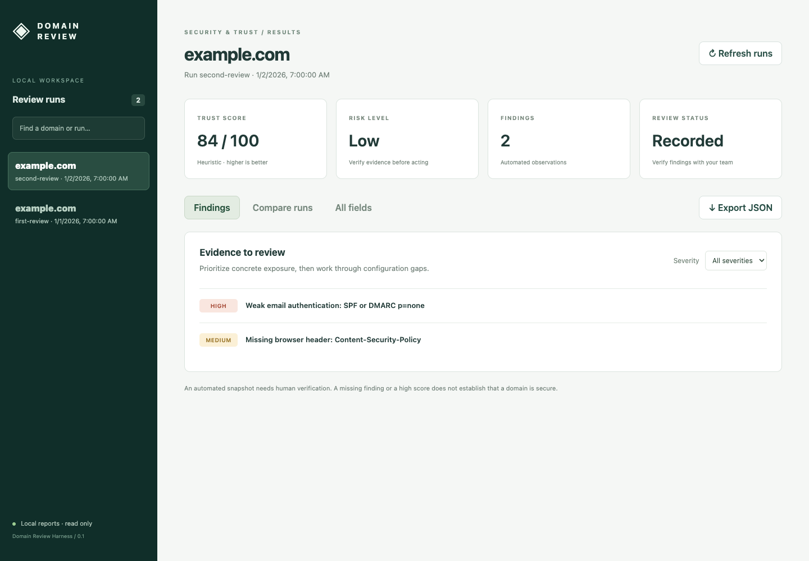

# Domain Review Harness

A free, self-hosted Rust harness for companies to review security and trust signals on their own domains. It produces a readable report, structured assessments, evidence, and comparisons between runs. No paid API, AI model, account, or hosted service is required.

**Status:** early development, currently distributed through a private GitHub repository. The code is MIT licensed and prepared for a future public release. Access currently requires repository permission.

## What it checks

- HTTPS redirects, TLS certificates, security headers, cookies, and email DNS configuration.
- Page metadata, forms, visible technology, same-origin JavaScript, and source indicators.
- Sensitive-file exposure, API responses, GraphQL introspection, and selected HTTP variants.
- Certificate-transparency discoveries, related hosts, and anonymous FTP exposure.

This is an **active security review**, not a passive crawler. Read [scope and network behavior](docs/scope.md) before running it. Results are observations for human verification, not a penetration-test certificate or proof of compliance.

## Install

Use Linux or macOS with a current stable [Rust toolchain](https://rustup.rs/), a C compiler/linker, `dig`, and `openssl`. Windows users should use WSL2; native Windows is not tested. Chrome/Chromium is optional for browser fallback.

```bash
# Ubuntu/Debian system prerequisites
sudo apt-get update
sudo apt-get install build-essential pkg-config dnsutils openssl ca-certificates

# With Rust installed:
git clone https://github.com/bosinupebi/domain-review-harness.git
cd domain-review-harness
cargo build --release --locked
./target/release/domain-review --help
```

On macOS, install Xcode Command Line Tools (`xcode-select --install`) and Rust. Check `dig -v` and `openssl version`; use `DOMAIN_REVIEW_OPENSSL` if an alternate OpenSSL executable is needed for HTTP fallback.

## Review your domain

Replace the placeholder with a domain you control. Confirm that you have permission for all behavior in [scope.md](docs/scope.md), including related hosts and anonymous FTP checks.

```bash
./target/release/domain-review review your-company.example \
  --authorized --output reports/first-review
```

Open `reports/first-review/report.md`, then inspect `assessment.json` and `evidence.jsonl` to verify each finding. The output directory must be new, so a later review cannot silently overwrite the previous one.

```bash
./target/release/domain-review review your-company.example \
  --authorized --output reports/second-review
./target/release/domain-review diff \
  --previous reports/first-review/assessment.csv \
  --current reports/second-review/assessment.csv \
  --output reports/changes.jsonl
```

`--timeout 15` sets the timeout per network operation; it is not an overall deadline. A full review can take several minutes or longer. See [CLI and configuration](docs/usage.md), [results reference](docs/results.md), and [troubleshooting](docs/troubleshooting.md).

## Browse results in the dashboard

```bash
./target/release/domain-review serve --reports reports
```

Open **http://127.0.0.1:8787** to browse saved runs, filter findings, inspect evidence, compare runs of the same domain, and export JSON. The dashboard is read-only and runs entirely locally. See [dashboard guide](docs/dashboard.md).

Try the dashboard with synthetic example runs (no scanning):

```bash
./target/release/domain-review serve --reports examples/runs
```



## Development

```bash
cargo fmt --check
cargo test --locked
cargo build --release --locked
```

Tests use synthetic data and local fixtures. Browser tests are optional. CI runs formatting and tests on Linux and macOS. No live company review runs in CI.

## Documentation and community

- [Architecture and extraction](docs/architecture.md)
- [Contributing](CONTRIBUTING.md)
- [Code of conduct](CODE_OF_CONDUCT.md)
- [Security policy](SECURITY.md)
- [Support](SUPPORT.md)
- [Roadmap](docs/roadmap.md) and [changelog](CHANGELOG.md)
- [MIT license](LICENSE)

Contributions should improve reproducibility, evidence quality, and useful remediation guidance. Generated domain reports and credentials do not belong in this repository.
